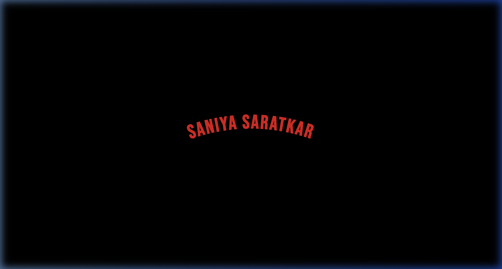
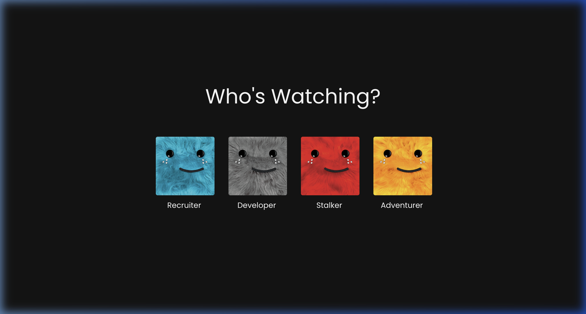
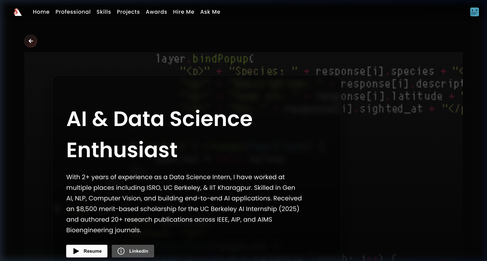
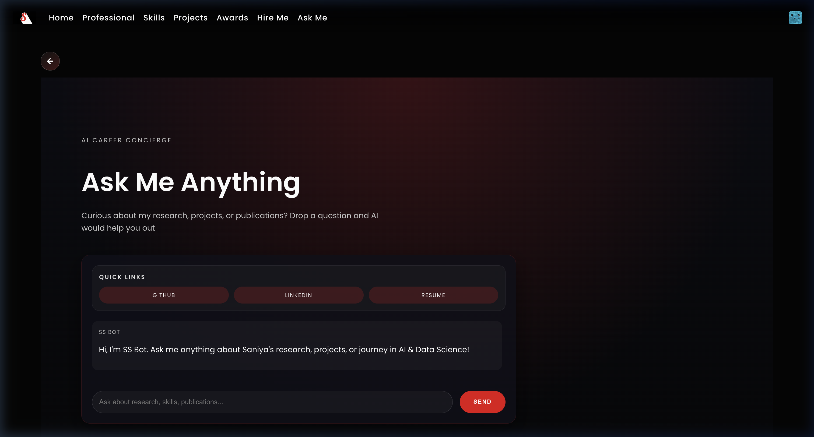

# Saniya Saratkar – Netflix-Inspired Portfolio

A Netflix-inspired portfolio website that transforms Saniya Saratkar's resume into an immersive, binge-worthy experience. Visitors land on the cinematic Netflix sting with "SANIYA SARATKAR" arc text, pick a persona tile, and then explore work experience at ISRO, UC Berkeley, IIT Kharagpur & Deeptiman System — plus projects, awards, skills, and an AI chatbot powered by Gemini.



## Experience Overview
- **Cinematic intro → persona gate.** One click triggers the Netflix audio sting and transitions to persona tiles. Each persona injects its own GIF background.
- **Profile rows like a streaming app.** The hero banner links to the resume (Google Drive) and LinkedIn, with Top Picks / Continue Watching rows for curated sections.
- **Deep-dive sections for every audience.** Dedicated routes for work experience, skills, projects, awards, certifications, recommendations, music, reading, blogs, and contact.
- **Ask Me Anything powered by Gemini.** SS Bot reads portfolio data and streams conversational markdown answers about Saniya's research, skills, and experience.
- **Live GitHub + Supabase content.** Spotlight cards hydrate with README summaries and cover art from GitHub, while Supabase tables keep content editable without code changes.

## Screenshots

_Netflix-style persona gate — choose "Recruiter", "Collaborator", or more to personalise the experience._


_Profile hero banner with headline, resume & LinkedIn CTAs, and navigation to all sections._


_Gemini-backed AI chatbot answering questions about Saniya's career, skills, projects, and publications._

## Highlights
- **Intro + persona gate** with custom audio, animated GIF avatars, and router state to theme the profile page.
- **Supabase-powered content** for timeline, skills, projects, recommendations, contact, etc., with graceful fallbacks while you seed tables.
- **Ask Me Anything (SS Bot)** streams site context into Gemini and renders markdown replies so visitors can chat about Saniya's story.
- **Responsive Netflix UI** with shared navbar/sidebar, section cards, GitHub repo feed, playlists, reading list, and downloadable recommendation letters.

## Tech Stack
- React 18 + TypeScript (Create React App)
- React Router 6
- Supabase JS SDK
- @google/generative-ai + markdown-to-jsx
- Custom CSS + react-icons

## Structure
```
src/
+-- App.tsx             # route map
+-- NetflixTitle.tsx    # intro animation + sound
+-- browse/             # persona selector grid
+-- components/         # NavBar, ProfileCard, buttons.
+-- pages/              # WorkExperience, Skills, Projects, AskMeAnything, etc.
+-- profilePage/        # banner + personalized rows
+-- queries/            # Supabase helpers
+-- lib/askGemini.ts    # Gemini wrapper
```

## Local Setup
```bash
git clone <repo>
cd netflix_portfolio
nvm install 18
nvm use 18
npm install
```
Create `.env` (or `.env.local`) with:
```
REACT_APP_SUPABASE_URL=https://<project>.supabase.co
REACT_APP_SUPABASE_ANON_KEY=<anon key>
REACT_APP_GEMINI_API_KEY=<browser-safe key>
REACT_APP_GITHUB_TOKEN=<optional PAT for higher GitHub limits>
```
Then run `npm start` and open http://localhost:3000.

## Scripts
- `npm start` - CRA dev server
- `npm run build` - optimized bundle in `build/`
- `npm test` - CRA Jest suite

## Deployment (GitHub Pages)
1. Run `npm run deploy` to build and publish to GitHub Pages.
2. Or in Project → Settings → Environment Variables add:
   - `REACT_APP_GEMINI_API_KEY`
   - `REACT_APP_GITHUB_TOKEN` (optional, for higher GitHub API limits)
3. The site is live at: https://saniya1312s.github.io/Saniya-Portfolio-/

## Sample Supabase Schema
```sql
create table if not exists profile_banner (
  id uuid primary key default gen_random_uuid(),
  background_url text,
  headline text,
  resume_url text,
  linkedin_url text,
  profile_summary text
);

create table if not exists skills (
  id uuid primary key default gen_random_uuid(),
  name text,
  category text,
  description text,
  icon text
);

create table if not exists timeline_items (
  id uuid primary key default gen_random_uuid(),
  timeline_type text,
  name text,
  title text,
  tech_stack text,
  summary_points text[],
  date_range text,
  sort_order int
);
```
Add tables for projects, contact, certifications, awards, etc. The UI automatically falls back to bundled sample data while you seed Supabase.

## Contributing
PRs are welcome for UI polish, accessibility, new personas, or deeper data/AI integrations. Please open an issue for larger features.

---
MIT License
